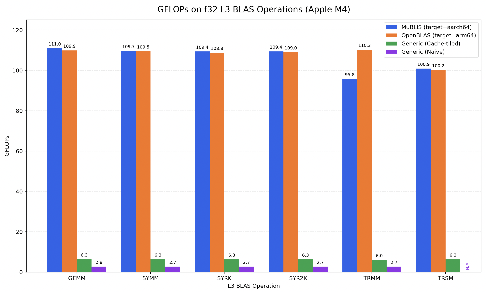

### What's MuBLIS?
MuBLIS is a framework for building fast, thread-safe, and hardware-optimized linear algebra libraries.  Its included ARM NEON and AVX2 micro-kernels help it match single-threaded OpenBLAS on 5 of 6 single-threaded L3 real BLAS operations out of the box on supported hardware, and MuBLIS can be easily extended to entirely new hardware in ~200 lines of code.

More software than ever can benefit from high performance implementations of linear algebra routines (think machine learning).  Because optimizing linear algebra routines is hard and highly dependent on hardware, software like NumPy and PyTorch usually link against BLAS (basic linear algebra subroutines) libraries provided by hardware vendors like Nvidia (cuBLAS) and Intel (MKL).

Implementing a full BLAS library (which you may want to do if you're working with obscure/new hardware) can be time consuming and difficult to get right.  MuBLIS splits the work of implementing a L3 BLAS library into a larger generic portion that requires no hardware-specific optimizations and small "micro-kernels" which should be hand optimized to the micro-architecture.  

It then serves as two libraries in one.  Its primary purpose is helping users quickly build new L3 BLAS libraries targeted towards custom hardware (which they can do in ~200 lines of hardware-specific code with MuBLIS), since MuBLIS provides an implementation of the large generic portion. This explains MuBLIS's name: BLIS = BLAS-like Library Instantiation Software.  However, MuBLIS can also be used out of the box as an efficient L3 BLAS implementation for many existing CPUs, since I've written and included optimized micro-kernels using ARM NEON and AVX2 intrinsics.

MuBLIS does not sacrifice performance for its generality.  With this repo's included NEON micro-kernels, MuBLIS can instantiate a BLAS library that slightly outperforms OpenBLAS (a highly optimized and popular BLAS implementation) built for my Apple Silicon machine, reaching ~80% peak FLOPs for single-threaded general matrix multiply.  When instantiated with an AVX2 micro-kernel, it achieves strong performance on several x86 CPUs, including the Intel Xeon Gold 6248R, AMD Ryzen 7 7700x, and the Intel i5-7500.  

The usefulness of being able to easily create hardware-specialized libraries is also demonstrated by the fact that specialized libraries instantiated with MuBLIS consistently achieve **~20x** speedups over reasonably optimized generic baseline implementations that use cache tiling.

MuBLIS can also be used to produce "fat binaries" at compile-time which support entire families of hardware, only specializing to a specific hardware target at run-time.

### L3 BLAS
The BLAS interface has 3 levels: L1 for scalar and vector operations, L2 for matrix-vector operations, and L3 for matrix-matrix operations.  L3 operations benefit the most from optimization, since memory loads grow in $O(n^2)$ while computation grows in $O(n^3)$.  Because of this, cache and register optimizations that allow for more computation to be done for a single load (usually by achieving better reuse) can lead to dramatically faster (think 2 orders of magnitude!) implementations.  L1 and L2 operations have comparatively less headroom for optimization since they do at most $O(n^2)$ computation work, and are easier to implement.  Therefore, MuBLIS currently only implements functionality for real L3 BLAS.  [BLIS](https://github.com/flame/blis), which this project is heavily inspired by, does in fact support the full BLAS interface.

BLAS exposes the following L3 routines for single and double precision real matrices:
With "op" denoting an optional transpose, 
- **GEMM** (General Matrix Multiply):  
  Computes $C \leftarrow \alpha \cdot \text{op}(A) \cdot \text{op}(B) + \beta C$
- **SYMM** (Symmetric Matrix Multiply):  
  Computes $C \leftarrow \alpha \cdot A \cdot B + \beta C$ (left sided) or $C \leftarrow \alpha \cdot B \cdot A + \beta C$ (right sided) with $A$ as a symmetric matrix (optionally, only one triangle of A needs to be stored)
- **SYRK** (Symmetric Rank-k Update):  
    $C \leftarrow \alpha \cdot A \cdot A^T + \beta \cdot C$ (left sided) or $C \leftarrow \alpha \cdot A^T \cdot A + \beta \cdot C$ (right sided), with $C$ as a symmetric matrix (this routine will only read and update one triangle, since $C$ remains symmetric)
- **SYR2K** (Symmetric Rank-2k Update):
$C \leftarrow \alpha \cdot A \cdot B^T + \alpha \cdot B \cdot A^T + \beta \cdot C$ (left sided) or $C \leftarrow \alpha \cdot A^T \cdot B + \alpha \cdot B^T \cdot A + \beta \cdot C$ (right sided), with $C$ as a symmetric matrix (this routine will only read and update one triangle, since $C$ remains symmetric).
- **TRMM** (Triangular Matrix Multiply):  
Overwrites $B$ in place with $B \leftarrow \alpha \cdot \text{op}(A) \cdot B$ (left sided) or $B \leftarrow \alpha \cdot B \cdot \text{op}(A)$ (right sided), with $A$ as a triangular matrix (optionally unit triangular).
- **TRSM** (Triangular Solve with Multiple Right-Hand Sides):  
Solves $\text{op}(A) \cdot X = \alpha B$ (left sided) or $X \cdot \text{op}(A) = \alpha B$ (right sided), with $A$ as a triangular matrix (optionally unit triangular), and overwrites $B$ in place with the solution $X$.
  
MuBLIS implements the out-of-place BLAS operations (GEMM, SYMM, SYRK, SYR2K) as shims to a general **L3 driver**.  The L3 driver is incredibly powerful, since it can handle arbitrary combinations of input and output matrix structures by allowing callers to specify its iteration space (fundamentally, matrix multiplies are 2 spatial and 1 reduction loops - think i, j, k).

Because this L3 driver can be so general, MuBLIS exposes its interface as well as the standard L3 (C)BLAS interface.

### Micro-kernels
The generic framework MuBLIS provides does cache-level optimizations like packing and tiling (since the "shape" of these optimizations is shared across all modern CPUs with multi-level caches), and breaks down a complex BLAS operation into small units of computation that are handed off to a hardware-specific micro-kernel.  To optimize for hardware not supported out of the box by MuBLIS, users will have to implement new micro-kernels.  

Common optimizations include:
- Register blocking
- Vectorization
- Software prefetch
- Considerations made for instruction level parallelism and latency hiding

More information is included in the README in `targets/`, as well as example micro-kernels implementing the aforementioned optimizations with C intrinsics.  Micro-kernels are also often implemented directly in assembly.

If you're interested in learning about these optimizations, you may be interested in my [repo](https://github.com/NinjadenMu/fast_matmul) showing you how to optimize matrix multiplication step-by-step from a naive i-j-k loop to the micro-kernels used by MuBLIS.

### Building
MuBLIS can produce static archives and dynamic libraries, and has been tested on MacOS and Linux across several hardware platforms.  Generated libraries implement the real L3 CBLAS interface (`include/cblas.h`), as well as MuBLIS's general driver and mirrors of CBLAS routines (`include/mublis.h`).

To build a BLAS library for a system optimized for out of the box by MuBLIS (check `config/`), run `make CONFIG={config name}`.  The `reference` config is generic and should be supported by all platforms.

### Instantiating New Libraries
To build a BLAS library for systems not supported out of the box, a new config and possibly new targets must be created.

A target contains the code MuBLIS needs to specialize to a hardware property (such as a specific microarchitecture or vector instruction extension set.)  A config contains the code needed by MuBLIS to select a specialized target to dispatch to at runtime.  

This separation is useful because it allows users to build "fat binaries" optimizing for several hardware platforms at once.  For example, users may create targets for Zen 3, Haswell, generic CPUs supporting AVX2 (already provided by MuBLIS), and generic CPUs not supporting vector extensions.  Then, users may create a single Linux x86 config containing code that detects the hardware platform at runtime and selects the most appropriate target, thus simultaneously targeting Zen 3, Haswell, AVX2 capable CPUs, and old x86 CPUs.

New hardware targets should be created and registered in `targets/`.  MuBLIS defines the interface all targets must fulfill in `include/mublis_instantiate.h`.  Generally, targets should contain micro-kernel implementations, a context object, and hardware-specific build rules if necessary.  More detailed information in `targets/README.md`.

New configs should be created in `config/`.  MuBLIS defines the interface all configs must fulfill in `include/mublis_instantiate.h`.  Generally, configs contain a function definition MuBLIS uses to dispatch to specialized hardware targets at runtime, and config-specific build rules.  MuBLIS's build system automatically discovers new configs.  More information in `config/README.md`.

### Testing
MuBLIS provides some non-comprehensive correctness tests in `test/correctness`, and a small benchmarking tool in `test/performance`.

### Repository Layout
- `include/` - Public headers for L3 CBLAS API, MuBLIS API, and library instantiation interfaces
- `frame/` - Hardware-independent implementation of the BLIS framework
  - `frame/base/` - Shared runtime infrastructure, including a pool allocator for MuBLIS's repeated large, fix sized, aligned memory allocations and helpers for runtime dispatch
  - `frame/l1m/` - Matrix-packing operations used by L3 operations (note that non-packing L1 BLAS operations aren't implemented)
  - `frame/l3/` - General L3 driver, MuBLIS mirrors of real L3 CBLAS operations
  - `frame/compat` - MuBLIS wrappers for compatibility with CBLAS
  - `frame/include/` - MuBLIS internal headers
- `targets/` - Hardware specialization code (micro-kernels, block sizes, contexts, compiler flags)
- `config/` - Build configurations
- `make/`
- `test/`
  - `test/correctness/` - Basic correctness tests for CBLAS interface
  - `test/performance/` - Performance benchmarking tools
